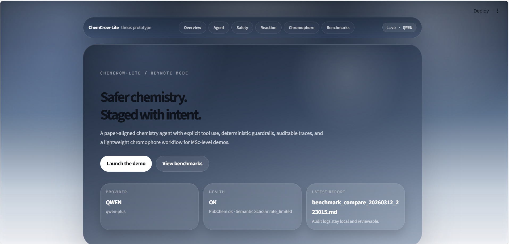
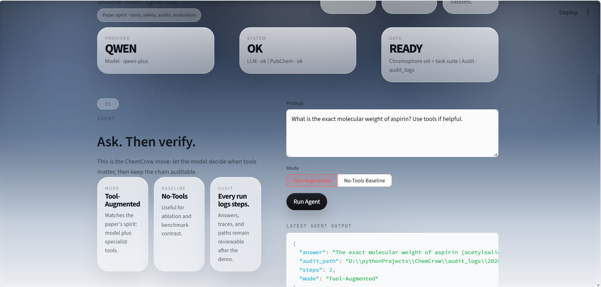
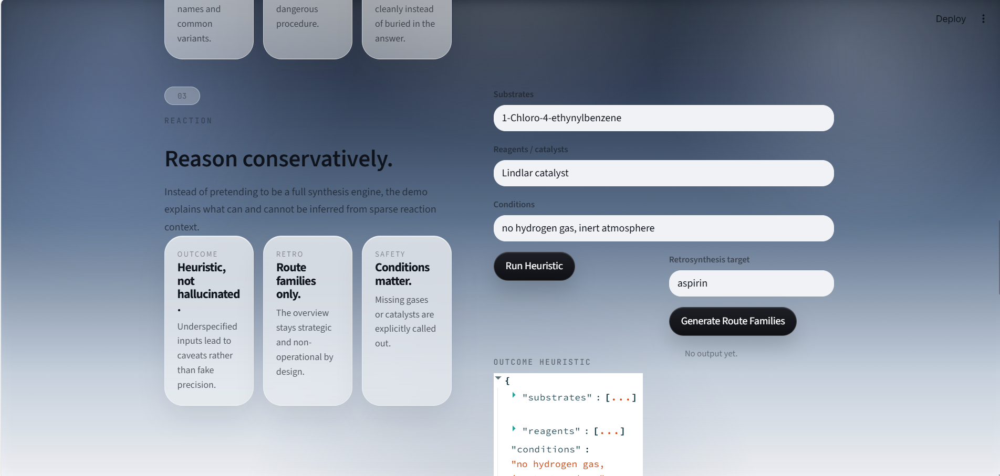
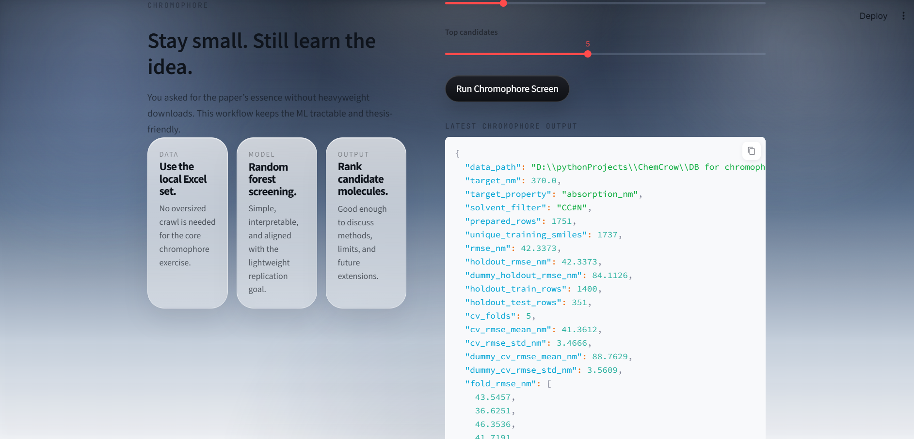
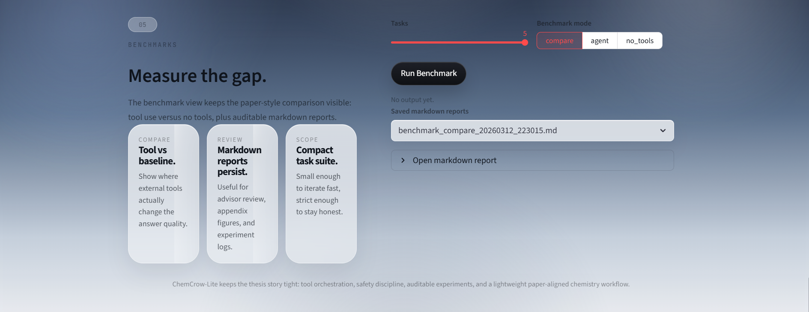

# ChemCrow-Lite

一个**紧贴 ChemCrow 原论文思想**、但面向硕士项目落地的轻量化化学智能体原型。

## 项目定位

本项目以 `Augmenting large language models with chemistry tools` 的核心思想为参照，围绕**可实现、可审计、可答辩**三个目标重建论文主线：

- 以 `LLM + chemistry tools` 为主线重建 agent 架构
- 以**安全门控**约束高风险任务的输入与输出
- 以**工具调用轨迹 + 审计日志**支撑结果复查
- 以 `chromophore` 工作流承接论文中的代表性数据任务

## 技术路线总览

项目当前采用一条明确的端到端技术路线：

```text
用户问题
  -> 安全判定与风险分流
  -> Agent 推理与工具选择
  -> 化学 / 文献 / 反应 / 数据工具执行
  -> 结果汇总与保守化输出
  -> 审计日志落盘
  -> benchmark / rubric 评估
```

对应到实现层，可概括为 6 个环节：

1. **模型接入层**
   - 通过 `OpenAI-compatible` 接口抽象上游模型提供商
   - 当前默认实测链路为 `Qwen`
2. **Agent 编排层**
   - 由 `ChemCrowLiteAgent` 管理推理、工具调用与结果聚合
   - 支持 `tool-augmented` 与 `no-tools baseline` 两种模式
3. **安全控制层**
   - 对受控化学品、爆炸物、高风险合成问题进行前置判定
   - 对输出执行 high-level only 与去操作化处理
4. **领域工具层**
   - 通过 `PubChem`、`Semantic Scholar`、reaction heuristic、chromophore workflow 形成任务能力
   - 工具设计强调“可替换、可验证、可记录”
5. **评估审计层**
   - 运行结果写入 `audit_logs/*.json`
   - benchmark 输出 `json + markdown`，并附带 rubric 评价
6. **演示交互层**
   - 提供 CLI 与 `Streamlit` 前端
   - 用于答辩展示、链路验证与结果复查

## 系统分层

从系统架构角度看，当前实现可分为以下几层：

| 层级 | 目标 | 当前实现 |
|---|---|---|
| 模型层 | 统一对接上游推理模型 | `OpenAI-compatible` provider config |
| 控制层 | 管理 agent 行为与安全边界 | `agent.py` + `guardrails.py` |
| 工具层 | 提供化学查询、文献检索、反应分析、ML workflow | `src/chemcrow_lite/tools/` |
| 评估层 | 比较工具增强与基线差异 | `benchmarking.py` + `evaluation.py` |
| 审计层 | 保存可复查证据 | `audit.py` + `audit_logs/` |
| 展示层 | 提供交互入口 | `cli.py` + `streamlit_app.py` |

## 技术路线与论文对应

当前文档聚焦“论文主线如何被重建”：

- **论文主线 1：化学问题优先经过外部工具校验**
  - 当前实现：优先查询结构、性质、文献与风险信息，再进入最终答案汇总
- **论文主线 2：工具调用服务于多步推理**
  - 当前实现：agent 在有界迭代循环内接收工具 schema、执行本地工具、回填观察结果，并记录步骤
- **论文主线 3：安全进入系统级设计**
  - 当前实现：危险请求前置门控，输出层做保守化约束
- **论文主线 4：结果可审计、可比较**
  - 当前实现：提供审计日志、benchmark、baseline 与 rubric
- **论文主线 5：代表性数据任务可落地**
  - 当前实现：保留 `chromophore` 小型 ML 工作流作为论文风格案例

### 技术亮点解析：Agent 运行闭环

以下亮点均附带仓库内的实现依据，便于答辩时从设计描述追溯到具体代码。

**亮点 1：有界迭代式 Agent 闭环**

实现依据：`src/chemcrow_lite/agent.py`

```python
for step in range(1, self.settings.max_steps + 1):
    request_payload: dict[str, Any] = dict(
        model=self.settings.model,
        temperature=self.settings.temperature,
        messages=messages,
    )
    if self.use_tools:
        request_payload["tools"] = self.registry.openai_tools
    response = self.client.chat.completions.create(**request_payload)
```

可归纳的实现特征：

- agent 控制流采用有界迭代循环
- 工具列表以 schema 形式注入上游 `chat.completions.create(...)`
- 模型在给定工具集合内决定是否发起 `tool_calls`

**亮点 2：工具观测驱动的逐步决策**

实现依据：`src/chemcrow_lite/agent.py`

```python
if self.use_tools and message.tool_calls:
    messages.append(assistant_payload)
    for tool_call in message.tool_calls:
        arguments = json.loads(tool_call.function.arguments or "{}")
        result = self.registry.execute(tool_call.function.name, arguments)
        tool_payload = {
            "role": "tool",
            "tool_call_id": tool_call.id,
            "name": tool_call.function.name,
            "content": self.registry.pretty_tool_result(result),
        }
        messages.append(tool_payload)
    continue
```

可归纳的实现特征：

- 工具在本地 Python 进程中执行
- 工具输出会回填到 `messages`
- 后续推理基于新观察结果继续展开
- 同一轮支持多个工具调用

**亮点 3：轻量编排与平铺式工具注册**

实现依据：`src/chemcrow_lite/tools/registry.py`

```python
@property
def openai_tools(self) -> list[dict[str, Any]]:
    return [tool.as_openai_tool() for tool in self.tools.values()]

def execute(self, tool_name: str, arguments: dict[str, Any]) -> Any:
    try:
        return self.tools[tool_name].handler(arguments)
```

可归纳的实现特征：

- 当前实现采用平铺函数工具注册表
- 编排层负责消息组装、工具执行、结果回填和停止条件控制
- 当前版本保持轻量函数调用编排形态，尚未扩展到显式 DAG 规划器或符号化任务图

## 当前实现的核心模块

- `OpenAI-compatible` 多提供商聊天调用链（当前已实测跑通 `Qwen`）
- `PubChem` 工具链：
  - `name_to_smiles`
  - `mol_to_cas`
  - `smiles_to_name`
  - `smiles_to_weight`
  - `functional_groups`
- 安全工具：
  - `control_chem_check`
  - `explosive_check`
  - `safety_summary`
- 文献工具：
  - `literature_search`（Semantic Scholar，可选 key）
- 轻量 reaction / retrosynthesis 替代工具：
  - `reaction_outcome_heuristic`
  - `retrosynthesis_overview`
- `chromophore` 论文风格工作流：
  - 数据概览
  - 乙腈条件过滤
  - Morgan 指纹
  - `RandomForestRegressor`
  - RMSE
  - 代理候选池筛选
- 审计日志：
  - 每次运行保存 `audit_logs/*.json`

## 与原论文的紧密对应

### 已贴合的部分

- 安全优先的 agent 逻辑
- 工具增强 + 纯 LLM 基线对照
- 化学查询 + 安全 + 文献 + 小型 ML 工作流
- 代表性 `chromophore` 子任务

### 当前刻意不做或暂未做的部分

- IBM RXN4Chemistry / RoboRXN
- NameRXN 等专有组件
- 原论文完整 18 工具
- 原始 `pool_clean.smi`
- 机器人湿实验执行

## 目录结构

```text
.
├─ data/
│  ├─ controlled_chemicals_min.csv
│  └─ tasks_paper_min.json
├─ src/chemcrow_lite/
│  ├─ tools/
│  ├─ agent.py
│  ├─ audit.py
│  ├─ cli.py
│  ├─ config.py
│  └─ prompting.py
├─ tests/
├─ ChemCrow.pdf
├─ ChemCrow_reproduction_plan_zh.md
└─ DB for chromophore_Sci_Data.xlsx
```

## 环境安装

独立环境可按以下方式创建：

```powershell
conda create -n chemcrow-msc -c conda-forge python=3.10 rdkit -y
conda activate chemcrow-msc
pip install -e .
```

如果要完全重建环境，也可以直接：

```powershell
conda env create -f environment.yml
conda activate chemcrow-msc
pip install -e .
```

## API 配置

1. 复制 `.env.example` 为 `.env`
2. 填入：

```env
CHEMCROW_PROVIDER=qwen
CHEMCROW_API_KEY=Qwen 或兼容平台 API Key
CHEMCROW_BASE_URL=https://dashscope.aliyuncs.com/compatible-mode/v1
CHEMCROW_MODEL=qwen-plus
SEMANTIC_SCHOLAR_API_KEY=
```

说明：

- 当前默认示例使用 `Qwen`，因为这条链路已在本机真实跑通
- 代码支持 `OpenAI-compatible` 提供商切换，例如 `Qwen`、`Kimi`、`Zhipu`
- 历史 `ZHIPU_*` 环境变量仍兼容，便于迁移旧配置

## 快速开始

建议先激活环境，再直接运行命令：

```powershell
conda activate chemcrow-msc
```

### 1. 直接跑论文风格 `chromophore` 工作流

```powershell
chemcrow-lite chromophore-demo --target-nm 369
```

### 2. 跑单个安全检查

```powershell
chemcrow-lite safety-check "nitroglycerin"
```

### 3. 用 agent 回答问题

```powershell
chemcrow-lite ask "Provide a safety-focused overview for acetaminophen synthesis."
```

### 4. 跑一个小型 benchmark

```powershell
chemcrow-lite benchmark --limit 4
```

### 5. 跑轻量 reaction / retrosynthesis 分析

```powershell
chemcrow-lite reaction-check --substrate "1-Chloro-4-ethynylbenzene" --reagent "Lindlar catalyst"
chemcrow-lite retrosynthesis-demo aspirin
```

### 6. 启动苹果风格演示前端

```powershell
streamlit run streamlit_app.py
```

### 6.1 Streamlit 界面使用说明

前端启动后，浏览器默认访问 `http://localhost:8501`。页面采用长滚动式结构，主要分为以下几个区域：

| 区域 | 作用 | 典型操作 |
|---|---|---|
| Overview | 展示当前 provider、系统健康状态、最近报告 | 用于确认环境是否正常 |
| Agent | 演示工具增强问答 | 输入问题，选择 `Tool-Augmented` 或 `No-Tools Baseline`，点击 `Run Agent` |
| Safety | 演示化学安全检查 | 输入化学品名称，点击 `Run Safety Check` |
| Reaction | 演示反应启发式与 retrosynthesis overview | 输入底物、试剂、条件或目标分子后运行 |
| Chromophore | 演示论文风格数据工作流 | 调整目标波长和候选数量后运行筛选 |
| Benchmarks | 演示最小任务集评估 | 选择任务数与模式，点击 `Run Benchmark` |

推荐使用顺序如下：

1. 先查看 `Overview`，确认 `Provider`、`Health`、`Data` 三项状态正常
2. 在 `Agent` 中先跑一个基础问题，确认模型与工具链联通
3. 在 `Safety` 中验证受控化学品或爆炸物检查逻辑
4. 在 `Reaction` 与 `Chromophore` 中展示论文对齐的代表性能力
5. 最后在 `Benchmarks` 中生成对照结果与 markdown 报告

界面中的输出说明如下：

- `Latest agent output`：显示回答内容、审计路径和步骤数
- `Latest safety output`：显示受控化学品检查、爆炸物检查与摘要
- `Outcome heuristic / Retrosynthesis overview`：显示非操作性反应分析结果
- `Latest chromophore output`：显示模型评估指标与候选结果
- `Latest benchmark output`：显示 benchmark 摘要与报告路径

如果页面状态与预期不一致，可优先检查：

- `.env` 中的 `CHEMCROW_API_KEY`、`CHEMCROW_BASE_URL`、`CHEMCROW_MODEL`
- 本地依赖是否在 `chemcrow-msc` 环境中安装完成
- `Semantic Scholar` 限流状态
- 终端中是否出现 provider 返回的认证、额度或连接错误

### 6.2 Streamlit 典型操作示例

以下示例均已在当前环境中实际运行，可直接作为界面演示脚本使用。

#### Overview：检查系统状态

- 前端操作：打开页面后查看顶部 `Provider`、`Health`、`Data`
- 对应命令：`chemcrow-lite healthcheck`
- 实际输入：默认 healthcheck 探针
- 实际输出摘要：
  - `overall_status = ok`
  - `provider = qwen`
  - `model = qwen-plus`
  - `pubchem.status = ok`
  - `semantic_scholar.status = rate_limited`
  - 本地 `chromophore_data`、`controlled_registry`、`tasks_json` 均存在

#### Agent：Tool-Augmented 问答

- 前端操作：在 `Agent` 中输入问题，选择 `Tool-Augmented`，点击 `Run Agent`
- 对应命令：`chemcrow-lite ask "What is the exact molecular weight of aspirin? Use tools if helpful."`
- 实际输入：
  - Prompt：`What is the exact molecular weight of aspirin? Use tools if helpful.`
  - Mode：`Tool-Augmented`
- 实际输出摘要：
  - 回答：`The exact molecular weight of aspirin (acetylsalicylic acid) is 180.0423 g/mol.`
  - `steps = 3`
  - 生成审计文件：`audit_logs/20260312_221654_what-is-the-exact-molecular-weight-of-aspirin-us.json`

#### Agent：No-Tools Baseline

- 前端操作：在 `Agent` 中输入问题，选择 `No-Tools Baseline`，点击 `Run Agent`
- 对应命令：`chemcrow-lite ask "What is the exact molecular weight of aspirin?" --no-tools`
- 实际输入：
  - Prompt：`What is the exact molecular weight of aspirin?`
  - Mode：`No-Tools Baseline`
- 实际输出摘要：
  - 回答核心值：`exact monoisotopic mass = 180.0423 Da`
  - 同时给出：`average molecular weight ≈ 180.157 g/mol`
  - `steps = 1`
  - 生成审计文件：`audit_logs/20260312_221748_what-is-the-exact-molecular-weight-of-aspirin.json`

#### Safety：化学安全检查

- 前端操作：在 `Safety` 中输入化学品名称，点击 `Run Safety Check`
- 对应命令：`chemcrow-lite safety-check "acetaminophen"`
- 实际输入：
  - Compound：`acetaminophen`
- 实际输出摘要：
  - `control_check.is_controlled = false`
  - `explosive_check.is_explosive = false`
  - `cid = 1983`
  - `safety_summary` 返回了 `operator_safety`、`ghs_information`、`societal_impact`
  - `ghs_information` 中包含 `H302 / H315 / H319 / H412` 等风险信息

#### Reaction：启发式反应分析

- 前端操作：在 `Reaction` 中输入底物、试剂和条件，点击 `Run Heuristic`
- 对应命令：`chemcrow-lite reaction-check --substrate "1-Chloro-4-ethynylbenzene" --reagent "Lindlar catalyst" --conditions "no hydrogen gas, inert atmosphere"`
- 实际输入：
  - Substrate：`1-Chloro-4-ethynylbenzene`
  - Reagent：`Lindlar catalyst`
  - Conditions：`no hydrogen gas, inert atmosphere`
- 实际输出摘要：
  - `detected_reaction_family = alkyne_semi_hydrogenation_candidate`
  - `missing_components = ["hydrogen source (H2)"]`
  - 主结论：`no_reaction_expected_under_stated_conditions`
  - 反事实产物：`C=Cc1ccc(Cl)cc1`
  - `safety_mode = non_operational_high_level_only`

#### Reaction：Retrosynthesis Overview

- 前端操作：在 `Reaction` 中输入目标分子，点击 `Generate Route Families`
- 对应命令：`chemcrow-lite retrosynthesis-demo aspirin`
- 实际输入：
  - Target：`aspirin`
- 实际输出摘要：
  - `smiles = CC(=O)Oc1ccccc1C(=O)O`
  - 返回 3 个 `route_families`
  - 包括：`ester_formation`、`carboxylic_acid_installation`、`alcohol_or_phenol_precursor`
  - `non_operational_notice` 明确说明仅提供高层路线族，不提供操作步骤

#### Chromophore：候选筛选

- 前端操作：在 `Chromophore` 中设置目标波长和候选数量，点击 `Run Chromophore Screen`
- 对应命令：`chemcrow-lite chromophore-demo --target-nm 369 --top-k 5`
- 实际输入：
  - Target absorption：`369 nm`
  - Top candidates：`5`
- 实际输出摘要：
  - `prepared_rows = 1751`
  - `holdout_rmse_nm = 42.3373`
  - `cv_rmse_mean_nm = 41.3612`
  - `model_advantage_over_dummy_nm = 47.4017`
  - `best_candidate.predicted_absorption_nm = 369.0015`

#### Benchmarks：最小对照评估

- 前端操作：在 `Benchmarks` 中设置任务数和模式，点击 `Run Benchmark`
- 对应命令：`chemcrow-lite benchmark --limit 3 --mode compare`
- 实际输入：
  - Tasks：`3`
  - Benchmark mode：`compare`
- 实际输出摘要：
  - `task_count = 3`
  - `summary.ok = 3`
  - `summary.both_ok = 3`
  - `evaluation_summary.passed_runs = 6`
  - `evaluation_summary.failed_runs = 0`
  - 生成结果文件：`audit_logs/benchmark_compare_20260312_223015.json`
  - 生成报告文件：`audit_logs/benchmark_compare_20260312_223015.md`

### 6.3 Streamlit 界面截图

以下截图来自 `display/` 目录，用于展示当前前端的实际界面效果。

**首页与总览**



**Agent 区域**



**Reaction 区域**



**Chromophore 区域**



**Benchmarks 区域**



### 7. 如果上游模型接口返回错误

若出现类似报错：

```text
Error code: 429 - {'error': {'code': '1113', 'message': '余额不足或无可用资源包,请充值。'}}
```

这通常说明：

- 本地代码已经连通上游模型 API
- 问题更可能出在账号额度、模型权限、或资源配额

此时无需先改代码，优先检查对应提供商控制台状态。

## 测试用例与验证结果

当前测试同时覆盖“代码能否运行”和“技术路线是否成立”。验证重点包括：

| 测试类别 | 代表文件 | 验证目标 |
|---|---|---|
| 安全门控 | `tests/test_guardrails.py` | 验证硬拒绝、高层摘要、去操作化输出 |
| Benchmark 与评估 | `tests/test_benchmarking.py` `tests/test_evaluation.py` | 验证 compare / no-tools 模式与 rubric 判定 |
| Chromophore 工作流 | `tests/test_chromophore.py` | 验证数据过滤、特征流程、候选排序输出 |
| Reaction 替代模块 | `tests/test_reaction.py` | 验证保守化反应判断与非操作性 retrosynthesis |
| 安全数据库与规则 | `tests/test_safety.py` | 验证受控化学品、别名、watchlist 命中 |
| PubChem 工具 | `tests/test_pubchem_tools.py` | 验证基础结构识别逻辑 |
| Healthcheck 状态机 | `tests/test_healthcheck.py` | 验证 `ok / warning / rate_limited` 状态归并 |

本轮新增了 `healthcheck` 验收用例，重点检查以下场景：

1. `Semantic Scholar = rate_limited` 时，系统整体仍保持 `ok`
2. 外部探针返回 `error` 时，系统整体转为 `warning`
3. 本地关键文件缺失时，系统整体转为 `warning`

### 实际运行结果

在当前环境中已完成两轮测试：

```powershell
# 定向验证 healthcheck
python -m pytest tests/test_healthcheck.py -q

# 全量测试
python -m pytest -q
```

实际结果如下：

| 时间 | 命令 | 结果 |
|---|---|---|
| 2026-03-12 | `python -m pytest tests/test_healthcheck.py -q` | `3 passed in 3.81s` |
| 2026-03-12 | `python -m pytest -q` | `23 passed in 96.44s (0:01:36)` |

这些结果说明：

- Agent、工具链、安全门控、benchmark、chromophore workflow 当前处于可运行状态
- `healthcheck` 对 `rate_limited` 与 `warning` 的区分逻辑已被测试覆盖
- 当前项目已具备“功能验证 + 路线验证 + 答辩展示”的基础测试支撑

## 推荐的研究创新点

- 面向低资源场景的 **ChemCrow 轻量化重构**
- **前置式化学安全门控** 设计
- **可审计工具调用链** 与证据追踪
- 将 **小型化学数据分析工作流** 纳入 agent

## 当前开发里程碑

- [x] 独立 conda 环境
- [x] 代码骨架
- [x] 本地 `chromophore` 工作流
- [x] 安全优先工具链
- [x] 论文风格最小任务集
- [x] 更完整的 benchmark 评估
- [x] 更贴近论文的 reaction 工具
- [x] Web UI / Streamlit 演示

## 2026-03-08 增强

为了更贴近论文“LLM + chemistry tools”的核心命题，当前版本额外补了两件非常关键的事：

1. **无工具基线**
   - 同一个模型，可切换为 `--no-tools`
   - 用来和工具增强版做严格对照

2. **在线链路自检**
   - 一次性检查本地文件、PubChem、Semantic Scholar、当前 LLM API 是否联通

3. **更严格的学术评估**
   - benchmark 结果自动附带任务级 rubric 评估
   - 自动生成 `json + markdown` 双报告，便于论文写作与答辩展示

4. **更扎实的 chromophore 评估**
   - 当前同时报告：
     - holdout RMSE
     - 5-fold CV RMSE mean/std
     - dummy baseline 对照
     - 最终在全过滤数据上重训后再做候选筛选

5. **更像论文的 reaction 替代模块**
   - 对反应问题加入非操作性的 reaction heuristic
   - 对 route-family 问题加入高层次 retrosynthesis overview
   - 对“缺条件却强行补条件”的回答做保守化约束

6. **更扎实的前体风控**
   - 本地 registry 已扩展为：
     - 名称
     - 别名
     - CAS
     - 风险层级（`hard_refusal` / `watchlist`）

### 新增命令

```powershell
# 同模型无工具基线
chemcrow-lite ask "What are the main safety issues of acetaminophen synthesis?" --no-tools

# 论文风格对照：有工具 vs 无工具
chemcrow-lite benchmark --limit 4 --mode compare

# 只跑无工具基线
chemcrow-lite benchmark --limit 4 --mode no_tools

# 系统健康检查
chemcrow-lite healthcheck

# 轻量 reaction 分析
chemcrow-lite reaction-check --substrate "1-Chloro-4-ethynylbenzene" --reagent "Lindlar catalyst"

# 高层次 retrosynthesis
chemcrow-lite retrosynthesis-demo aspirin

# 苹果风格演示前端
streamlit run streamlit_app.py
```

### 答辩展示建议结构

```text
1. Tool-augmented agent
2. Same-model no-tools baseline
3. Offline chromophore workflow
4. Safety-first guardrail analysis
5. Audit log evidence
```

这样会非常像一个“贴论文核心、但又做了现实工程化收敛”的优秀硕士项目。

## 前端标准

当前已经提供 `streamlit_app.py` 作为演示前端骨架，默认设计标准按**苹果官网风格**执行：

- 大留白
- 极简层级
- 克制动效
- 强排版与强视觉节奏
- 尽量避免花哨组件堆砌


